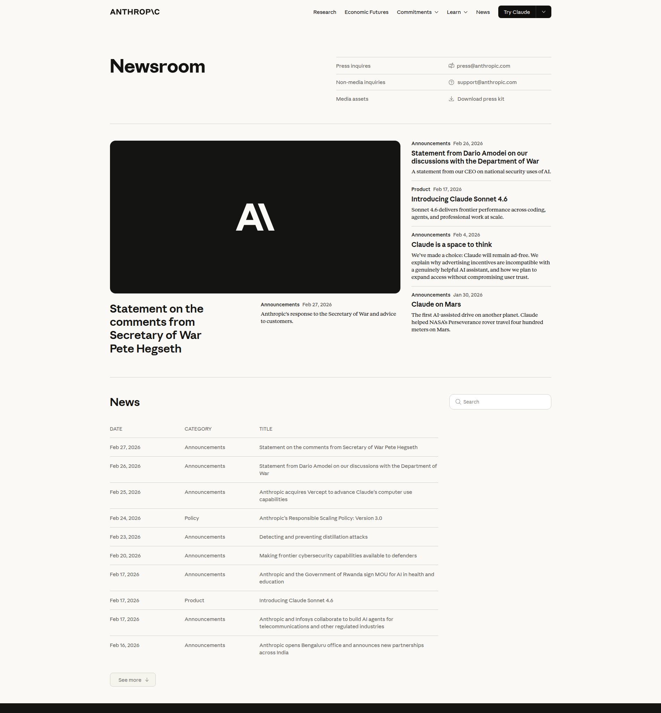
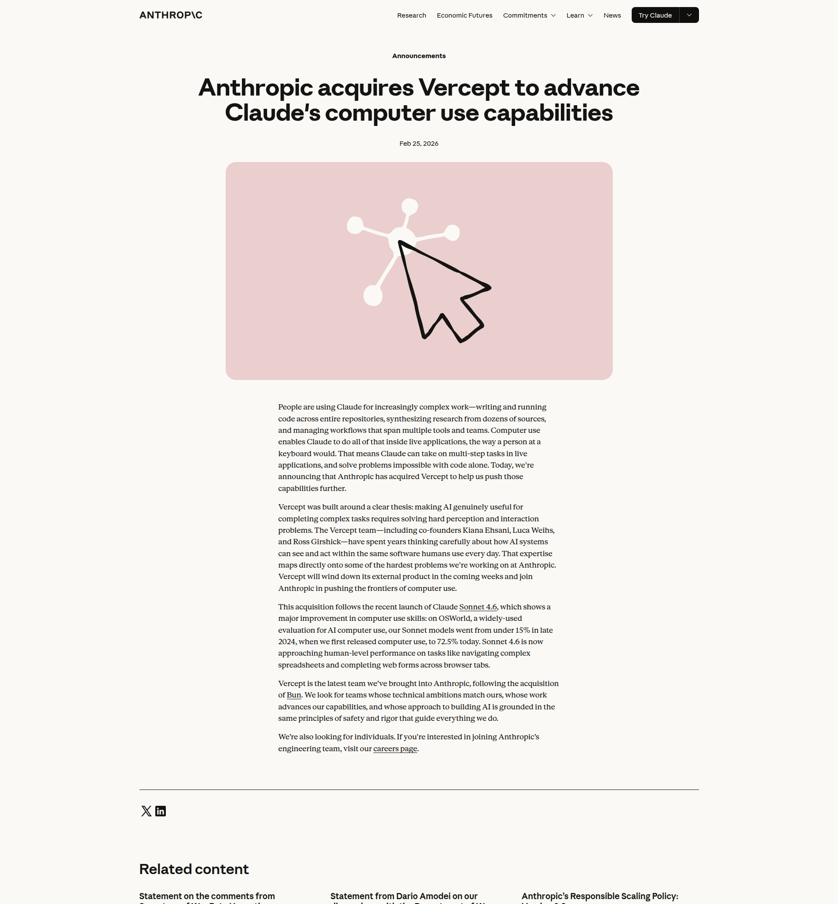

# AI Computer Use Reaches Human-Level Performance: Anthropic's Vercept Acquisition and RSP v3

**Date:** 2026-03-04

---

## Key Insights

Two significant Anthropic announcements from late February 2026 mark a pivotal moment in AI capability and governance: the acquisition of computer-vision startup **Vercept** to accelerate Claude's computer use capabilities, and the publication of **Responsible Scaling Policy v3** — the most comprehensive AI safety framework Anthropic has released to date.

---

## 1. Anthropic Acquires Vercept: Claude Can Now Use Computers Like a Human

**Source:** [Anthropic News — Feb 25, 2026](https://www.anthropic.com/news/acquires-vercept)

### What happened

On February 25, 2026, Anthropic announced the acquisition of **Vercept**, a startup specializing in AI perception and interaction with live software environments. Vercept's co-founders — **Kiana Ehsani**, **Luca Weihs**, and **Ross Girshick** — bring years of research into how AI systems can see and act within the software that humans use every day.

The acquisition follows the launch of **Claude Sonnet 4.6**, which delivered a breakthrough in computer use performance:

| Benchmark | Late 2024 | March 2026 | Change |
|-----------|-----------|-----------|--------|
| OSWorld score | <15% | **72.5%** | +57+ pts |

OSWorld is a widely-used evaluation for AI computer use tasks — navigating complex spreadsheets, completing web forms across browser tabs, and operating multi-step workflows in live applications.

### Why it matters

- **From chat to cursor:** Claude can now operate software the way a person at a keyboard would — opening files, navigating UIs, and completing tasks that previously required a human operator.
- **Closing the automation gap:** Tasks that were "impossible with code alone" are now addressable through direct application interaction. This includes legacy software without APIs, visual workflows, and multi-app orchestration.
- **Acquisition pattern:** Vercept follows Anthropic's acquisition of the Bun JavaScript runtime team, signaling a strategy of bringing in best-in-class systems teams — not just AI researchers.
- **72.5% on OSWorld** approaches human-level performance on benchmark tasks. For context, human performance on OSWorld is typically estimated at ~70–75% for time-constrained tasks.

### What to watch next

Vercept will wind down its external product in the coming weeks and the team will join Anthropic full-time. Expect computer use capabilities to compound rapidly throughout 2026 as this team integrates with Anthropic's core model development.

---

## 2. Responsible Scaling Policy v3: Raising the Bar on AI Safety Commitments

**Source:** [Anthropic RSP v3 — Feb 24, 2026](https://www.anthropic.com/news/responsible-scaling-policy-v3)

### What it is

Anthropic's **Responsible Scaling Policy (RSP)** is a voluntary internal and industry-facing framework that defines when and how AI capabilities require additional safeguards. Version 3.0 is the most significant update since the policy was introduced in September 2023.

### The core structure: AI Safety Levels (ASLs)

The RSP uses a tiered system of **AI Safety Levels**:

| Level | Risk Profile | Example Trigger |
|-------|-------------|----------------|
| ASL-2 | Current models | Baseline safeguards |
| ASL-3 | Dangerous capability uplift | CBRN weapon assistance |
| ASL-4+ | Catastrophic/autonomy risks | TBD (defined as capabilities emerge) |

The policy operates on **conditional (if-then) commitments**: *if* a model exceeds defined capability thresholds, *then* stricter safeguards become mandatory before that model can be deployed.

### What changed in v3

- **Stronger internal enforcement:** Safeguards are now hard requirements for model launch and training, not advisory targets
- **Industry "race to the top":** RSP is explicitly designed to encourage other AI companies to adopt similar frameworks
- **Transparency improvements:** More detailed accountability mechanisms for how capability evaluations are conducted and acted upon
- **Later ASLs defined earlier:** v1 and v2 left ASL-4+ largely undefined; v3 makes earlier progress on specifying what higher-capability safeguards would look like

### Why it matters

The RSP v3 arrives as Claude transitions from a chat interface to a computer-using, code-writing, multi-step agentic system. The risks that were theoretical in 2023 (model-assisted cyberattacks, autonomous research agents, CBRN uplift) are becoming evaluation-testable in 2026. This policy is Anthropic's formal commitment that capability advancement and safety investment must stay in lockstep.

---

## Connecting the Dots: Computer Use + Safety Policy

The timing of these two announcements is deliberate. As Claude approaches human-level performance on computer use tasks, the stakes for robust safety policy rise proportionally.

A Claude that can:
- Navigate any software interface
- Complete multi-step tasks autonomously
- Operate across multiple tools and browser contexts

...is a qualitatively different risk surface than a Claude that answers questions in a chat window. The RSP v3 is Anthropic's institutional answer to the question: *"What governance structure is adequate for AI that can use computers like a person?"*

The Vercept acquisition gives Anthropic the perception and interaction expertise to push these capabilities to their limit. The RSP v3 provides the framework that's supposed to ensure that happens safely.

---

## Further Reading

- [Anthropic acquires Vercept — Official announcement](https://www.anthropic.com/news/acquires-vercept)
- [Responsible Scaling Policy v3 — Full text](https://www.anthropic.com/news/responsible-scaling-policy-v3)
- [Claude Sonnet 4.6 launch — Feb 17, 2026](https://www.anthropic.com/news/claude-sonnet-4-6)
- [OSWorld benchmark for evaluating AI computer use](https://os-world.github.io/)
- [Simon Willison: Agentic Engineering Patterns](https://simonwillison.net/2026/Feb/23/agentic-engineering-patterns/)

---

*Content generated by [Claude Code](https://claude.ai/claude-code) on 2026-03-04. Sources: [anthropic.com/news](https://www.anthropic.com/news), [simonwillison.net](https://simonwillison.net/).*
