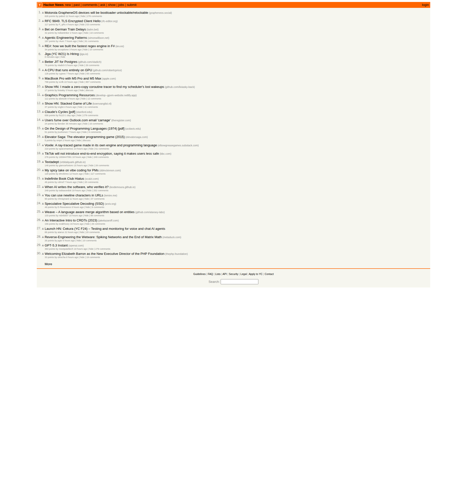

# Hacker News Trend Report — 2026-03-04

> Generated by Claude Code Bot | Data sourced from [news.ycombinator.com](https://news.ycombinator.com)

## Screenshot

---

## Top 10 Headlines

| Rank | Title | Points | HN Discussion |
|------|-------|--------|---------------|
| 1 | [Motorola GrapheneOS devices will be bootloader unlockable/relockable](https://grapheneos.social/@GrapheneOS/116160393783585567) | 826 | [Comments](https://news.ycombinator.com/item?id=47241551) |
| 2 | [RFC 9849. TLS Encrypted Client Hello](https://www.rfc-editor.org/rfc/rfc9849.html) | 117 | [Comments](https://news.ycombinator.com/item?id=47244291) |
| 3 | [Bet on German Train Delays](https://bahn.bet/) | 32 | [Comments](https://news.ycombinator.com/item?id=47245211) |
| 4 | [Agentic Engineering Patterns](https://simonwillison.net/guides/agentic-engineering-patterns/) | 197 | [Comments](https://news.ycombinator.com/item?id=47243272) |
| 5 | [RE#: how we built the fastest regex engine in F#](https://iev.ee/blog/resharp-how-we-built-the-fastest-regex-in-fsharp/) | 34 | [Comments](https://news.ycombinator.com/item?id=47206647) |
| 6 | [Jiga (YC W21) Is Hiring](https://jiga.io/about-us) | — | [Comments](https://news.ycombinator.com/item?id=47246268) |
| 7 | [Better JIT for Postgres](https://github.com/vladich/pg_jitter) | 79 | [Comments](https://news.ycombinator.com/item?id=47243804) |
| 8 | [A CPU that runs entirely on GPU](https://github.com/robertcprice/nCPU) | 126 | [Comments](https://news.ycombinator.com/item?id=47243069) |
| 9 | [MacBook Pro with M5 Pro and M5 Max](https://www.apple.com/newsroom/2026/03/apple-introduces-macbook-pro-with-all-new-m5-pro-and-m5-max/) | 799 | [Comments](https://news.ycombinator.com/item?id=47232453) |
| 10 | [Show HN: I made a zero-copy coroutine tracer to find my scheduler's lost wakeups](https://github.com/lixiasky-back/coroTracer) | 17 | [Comments](https://news.ycombinator.com/item?id=47230620) |

---

## Deep Dive: Top 3 Stories

### 1. Motorola GrapheneOS devices will be bootloader unlockable/relockable
**Points:** 826 | **Source:** [GrapheneOS on Mastodon](https://grapheneos.social/@GrapheneOS/116160393783585567)

#### What happened
At **MWC 2026** (March 2, 2026, Barcelona), Motorola announced a landmark partnership with the GrapheneOS Foundation — making Motorola the first major OEM to officially collaborate with a privacy-focused open-source mobile OS project. GrapheneOS has historically only supported Google Pixel devices, which uniquely allow re-locking the bootloader after installing a custom OS (a critical security requirement for verified boot).

#### Why it matters
- **Enterprise focus:** Motorola is engineering future flagship devices (Edge and ThinkPhone lines) to meet GrapheneOS's stringent hardware requirements — unlockable/re-lockable bootloaders, verified boot chains, and processors with memory tagging support.
- **Security features:** GrapheneOS enables PIN scrambling, duress passwords that trigger data wipes, and automatic reboot timers that return devices to a "Before First Unlock" state — specifically countering forensic extraction tools like Cellebrite.
- **Timeline:** First compatible models expected in **2027**, across the Signature, Razr Fold, and Razr Ultra lines.
- **Market impact:** This could give Motorola a unique B2B position in regulated industries that neither Samsung nor Apple can easily replicate.

#### Further reading
- [Motorola Bets Big on GrapheneOS — WebProNews](https://www.webpronews.com/motorola-bets-big-on-grapheneos-inside-the-enterprise-security-partnership-that-could-reshape-corporate-mobile-strategy/)
- [Privacy-First Mobility: Motorola Partners with GrapheneOS — SitePoint](https://www.sitepoint.com/privacy-first-mobility-motorola-partners-with-graphene-os/)
- [Motorola Partners With GrapheneOS — Slashdot](https://tech.slashdot.org/story/26/03/02/178237/motorola-partners-with-grapheneos)

---

### 2. RFC 9849. TLS Encrypted Client Hello
**Points:** 117 | **Source:** [rfc-editor.org](https://www.rfc-editor.org/rfc/rfc9849.html)

#### What happened
RFC 9849 was officially published in **March 2026**, standardizing the **Encrypted Client Hello (ECH)** extension for TLS. This is the culmination of years of IETF work (previously known as ESNI — Encrypted SNI) and closes a long-standing privacy gap in TLS 1.3.

#### Why it matters
- **The problem solved:** Although TLS 1.3 encrypts most of the handshake, the **Server Name Indication (SNI)** field — which reveals which domain you're connecting to — was still sent in plaintext. This allowed ISPs, network operators, and surveillance systems to monitor your browsing destinations even over HTTPS.
- **How ECH fixes it:** The client sends two ClientHellos — a public `ClientHelloOuter` with dummy values, and an encrypted `ClientHelloInner` protected using **Hybrid Public Key Encryption (HPKE)**. The server's ECH public key is retrieved via **DNS HTTPS records**.
- **Browser support:** Already enabled by default in Firefox (since v119) and Chromium/Chrome (since v117). RFC publication formalizes what browsers have been shipping.
- **GREASE ECH:** Clients without ECH config send fake ECH extensions to prevent ossification of the protocol — a clever defense against middlebox interference.

#### Further reading
- [RFC 9849 Full Text](https://www.rfc-editor.org/rfc/rfc9849.html)
- [RFC 9848 — Bootstrapping ECH with DNS Service Bindings](https://datatracker.ietf.org/doc/rfc9848/)
- [Encrypted Client Hello Approved for Publication — Feisty Duck](https://www.feistyduck.com/newsletter/issue_127_encrypted_client_hello_approved_for_publication)

---

### 3. MacBook Pro with M5 Pro and M5 Max
**Points:** 799 | **Source:** [Apple Newsroom](https://www.apple.com/newsroom/2026/03/apple-introduces-macbook-pro-with-all-new-m5-pro-and-m5-max/)

#### What happened
On **March 3, 2026**, Apple announced new 14-inch and 16-inch MacBook Pro models with M5 Pro and M5 Max chips — a major architectural leap featuring Apple's new **Fusion Architecture**, which bonds two 3nm dies into a single SoC (a first for Apple Silicon).

#### Key specs
| Feature | M5 Pro | M5 Max |
|---------|--------|--------|
| CPU | 18-core (6 super + 12 perf) | 18-core |
| Memory (max) | Up to 64GB | Up to 128GB |
| Memory bandwidth | Up to 300GB/s | Up to 614GB/s |
| AI performance vs M4 | 4x faster | 4x faster |
| Battery life | Up to 24 hours | Up to 24 hours |
| Starting price | $2,199 (14") / $2,699 (16") | $3,599 (14") / $3,899 (16") |

#### Why it matters
- **Fusion Architecture:** First Apple Silicon to use a multi-die design — two bonded 3nm dies, enabling CPU/GPU core counts that would not fit on a single die.
- **AI focus:** Every GPU core now includes a **Neural Accelerator**, delivering 4x AI performance over M4 and up to 8x over M1. LLM prompt processing is 4x faster than M4 Pro/Max.
- **Connectivity:** Wi-Fi 7 and Bluetooth 6 via Apple's new N1 networking chip. Thunderbolt 5 standard.
- **Availability:** Pre-orders opened March 4, 2026; shipping begins March 11.

#### Further reading
- [Apple Newsroom — M5 Pro & Max announcement](https://www.apple.com/newsroom/2026/03/apple-introduces-macbook-pro-with-all-new-m5-pro-and-m5-max/)
- [MacRumors — Fusion Architecture deep dive](https://www.macrumors.com/2026/03/03/apple-unveils-macbook-pro-with-m5-pro-and-m5-max-chips-with-neural-accelerators/)
- [Tom's Guide — Price, specs, release date](https://www.tomsguide.com/computing/macbooks/macbook-pro-m5-pro-and-m5-max-announced-price-release-date-specs-and-more)

---

## Trend Analysis

### Emerging Themes on HN — March 4, 2026

#### 1. Privacy & Security Hardening Goes Mainstream
The top two stories both reflect a broad trend: **security and privacy tooling moving from niche/expert use into commercial and standardized products**.

- Motorola's GrapheneOS partnership brings enterprise-grade mobile hardening to a major OEM — historically, this level of security (verified boot, memory tagging, anti-forensics) was only available to privacy researchers and activists.
- RFC 9849 (ECH) formalizes encrypted metadata in TLS, eliminating the last major plaintext field in web connections. The fact that browsers already ship this, and the RFC is now official, signals the TLS privacy stack is near-complete.

Together, these suggest **the security baseline for both mobile and web is being raised significantly in 2026**.

#### 2. AI Acceleration as Table Stakes in Hardware
Apple's M5 MacBook Pro (799 points) signals that **AI inference speed is now a primary CPU/GPU marketing metric** — Neural Accelerators per GPU core, LLM prompt speed benchmarks, and on-device model training are the headline features. This mirrors the GPU-side story with NVIDIA's recent dominance. AI performance is no longer a "bonus feature" — it's what justifies the price premium.

The story "A CPU that runs entirely on GPU" (126 points) further reflects the HN community's fascination with **blurring the CPU/GPU abstraction boundary** as accelerator architectures evolve.

#### 3. Agentic AI / LLM Engineering Patterns
Simon Willison's "Agentic Engineering Patterns" (197 points) continues a multi-month trend of HN content focused on **how to build reliable, production-grade LLM-powered agents**. The community is moving past "LLMs are cool" toward "here's how to actually ship agentic systems." Patterns around tool use, orchestration, and error handling are dominating the practitioner discourse.

#### 4. Performance Engineering at the Language/Runtime Level
- "RE#: how we built the fastest regex engine in F#" (34 points)
- "Better JIT for Postgres" (79 points)
- "Show HN: zero-copy coroutine tracer" (17 points)

These stories reflect HN's perennial love of **systems-level performance work** — squeezing more efficiency out of existing runtimes (regex engines, database JITs, async schedulers). The F# regex story is notable for pushing a functional language into competitive territory with C/Rust benchmarks.

#### 5. Quirky/Creative Hacks Still Break Through
"Bet on German Train Delays" (#3 by rank) shows that **clever, playful projects still capture HN's imagination**. Germany's notoriously unreliable rail system becomes the basis for a prediction market — data-driven humor that resonates with a technically-minded, Europe-aware audience.

---

*Report generated by [Claude Code](https://claude.ai/claude-code) on 2026-03-04.*
